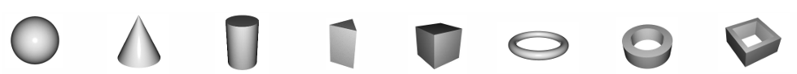
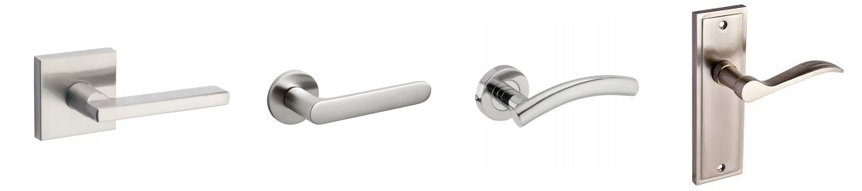

## Contents
- [Concept Template Extension Tutorial](#concept-template-extension-tutorial)
  - [1. Geometry Templates](#1-geometry-templates)
    - [1.1 Parameters](#11-parameters)
    - [1.2 The Default Shape](#12-the-default-shape)
    - [1.3 Deformation](#13-deformation)
    - [1.4 Application of Pose](#14-application-of-pose)
    - [1.5 Extension](#15-extension)
  - [2. Concept Templates](#2-concept-templates)
    - [2.1 Selecting the Components](#21-selecting-the-components)
    - [2.2 Arrangements of Components \& Parameters](#22-arrangements-of-components--parameters)
    - [2.3 Parameters of Components](#23-parameters-of-components)
      - [Discussion: Discrete Parameters](#discussion-discrete-parameters)
    - [2.4 Component Assembly \& Application of Pose](#24-component-assembly--application-of-pose)

<hr>

# Concept Template Extension Tutorial

There are two major steps in constructing a new concept template for a specific concept: **select the component templates** and **determine how they are arranged**.

Specifically, we first select the appropriate component templates (either geometry or concept ones) to describe the geometric structure of the desired concept. 
Then, we summarize the shared patterns (*e.g.* pose, repetitions, *etc.*) among the component templates and embed them during the design of concept template parameters.
We would also like to point out that there are likely more than one possible template implementation for a specific concept, we do not prefer one implementation over another as long as they are equally effective and efficient.

Below we demonstrate detailed template designs & implementations using our released codes as example.

## 1. Geometry Templates

We begin by first introducing geometry templates, which **are templates for commonly used geometric shapes that make up the concept templates**. 
The instantiation of the template will result in a template instance with two attributes, *i.e.* `vertices` and `faces`, 
which together represents the mesh of the shape parameterized by the given parameters.

Currently, we have implemented a total of 9 geometry templates to cover all the concept templates in ConceptFactory. Some examples of the template instances are shown in the figure below.



For implementation, we encapsulate each geometry template into a class. 
Below we show the specific implementation of geometry template `Cuboid` as a class, as well as detailed explanations.

```python
class Cuboid(GeometryTemplate):
    def __init__(self, height, top_length, top_width = None, bottom_length = None, bottom_width = None, top_offset = [0, 0], back_height = None, position = [0, 0, 0], rotation = [0, 0, 0], rotation_order = "XYZ"):
        """
        :param height: height of the front surface of the cuboid in the Y-axis direction
        :param top_length: length of the top surface of the cuboid in the X-axis direction
        :param top_width: width of the top surface of the cuboid in the Z-axis direction
        :param bottom_length: length of the bottom surface of the cuboid in the X-axis direction
        :param bottom_width: width of the bottom surface of the cuboid in the Z-axis direction
        :param top_offset: offset between the upper and lower surface of the cuboid in the X-axis and Z-axis directions
        :param back_height: height of the back surface of the cuboid in the Y-axis direction
        :param position: position (x, y, z) of the cuboid
        :param rotation: rotation of the cuboid, represented via Euler angles (x, y, z)
        :param rotation_order: rotation order of the three rotation axes of the cuboid

        """

        # Filling Missing Values
        if top_width == None:
            top_width = top_length
        if bottom_length == None:
            bottom_length = top_length
        if bottom_width == None:
            bottom_width = top_width
        if back_height == None:
            back_height = height

        super().__init__(position, rotation, rotation_order)

        # Record Parameters
        self.height = height
        self.top_length = top_length
        self.top_width = top_width
        self.bottom_length = bottom_length
        self.bottom_width = bottom_width
        self.top_offset = top_offset
        self.back_height = back_height
        self.position = position
        self.rotation = rotation
        self.rotation_order = rotation_order
            
        # Manually Defined Default Template Instance 
        self.vertices = np.array([
            [-1 / 2, 1 / 2, 1 / 2],
            [1 / 2, 1 / 2, 1 / 2],
            [-1 / 2, 1 / 2, -1 / 2],
            [1 / 2, 1 / 2, -1 / 2],
            [-1 / 2, -1 / 2, 1 / 2],
            [1 / 2, -1 / 2, 1 / 2],
            [-1 / 2, -1 / 2, -1 / 2],
            [1 / 2, -1 / 2, -1 / 2]
        ])

        self.faces = np.array([
            [0, 1, 2], [1, 3, 2],
            [4, 6, 5], [5, 6, 7],
            [0, 4, 5], [0, 5, 1],
            [2, 7, 6], [2, 3, 7],
            [0, 6, 4], [0, 2, 6],
            [1, 5, 7], [1, 7, 3]
        ])

        # Differentiable Deformation
        vertices_resize = np.array([
            [top_length, height, top_width], 
            [top_length, height, top_width], 
            [top_length, back_height, top_width],
            [top_length, back_height, top_width],
            [bottom_length, height, bottom_width],
            [bottom_length, height, bottom_width],
            [bottom_length, back_height, bottom_width],
            [bottom_length, back_height, bottom_width]
        ])
        self.vertices = self.vertices * vertices_resize

        vertices_offset = np.array([
            [top_offset[0], 0, top_offset[1]], 
            [top_offset[0], 0, top_offset[1]], 
            [top_offset[0], (back_height - height) / 2, top_offset[1]],
            [top_offset[0], (back_height - height) / 2, top_offset[1]],
            [0, 0, 0],
            [0, 0, 0],
            [0, (back_height - height) / 2, 0],
            [0, (back_height - height) / 2, 0]
        ])
        self.vertices = self.vertices + vertices_offset

        # Global Transformation
        self.vertices = apply_transformation(self.vertices, position, rotation, rotation_order)
```

### 1.1 Parameters

We define and receive the parameters of the geometry template in the `__init__` function of the template class:

```python
class Cuboid(GeometryTemplate):
    def __init__(self, height, top_length, top_width = None, bottom_length = None, bottom_width = None, top_offset = [0, 0], back_height = None, position = [0, 0, 0], rotation = [0, 0, 0], rotation_order = "XYZ"):
        """
        :param height: height of the front surface of the cuboid in the Y-axis direction
        :param top_length: length of the top surface of the cuboid in the X-axis direction
        :param top_width: width of the top surface of the cuboid in the Z-axis direction
        :param bottom_length: length of the bottom surface of the cuboid in the X-axis direction
        :param bottom_width: width of the bottom surface of the cuboid in the Z-axis direction
        :param top_offset: offset between the upper and lower surface of the cuboid in the X-axis and Z-axis directions
        :param back_height: height of the back surface of the cuboid in the Y-axis direction
        :param position: position (x, y, z) of the cuboid
        :param rotation: rotation of the cuboid, represented via Euler angles (x, y, z)
        :param rotation_order: rotation order of the three rotation axes of the cuboid

        """
```

We categorize the parameters into two types based on their functionality, *i.e.* those control **geometric shapes** and those control **pose**.

The parameters that control the pose are universally present across templates, with `position` controlling the shape's position (displacement along the x, y, and z axes), 
and `rotation` controlling the shape's rotation angles around the x, y, and z axes; the `rotation_order` parameter controls the order of rotation around the three axes.
The two rotation-related parameters together form a representation of Euler angle.

The parameters that control the geometric shapes are case-specifically defined, as different geometry templates have different features in terms of physical shapes. 
In practice, we have found that using only trivial parameter definitions (*e.g.* `length`, `width` and `height` for template `Cuboid`) can be insufficient under certain
use cases for concept templates. Therefore, we recommend a more thorough definition of shape parameters with higher degrees of freedom for geometry templates, which will significantly
improve the representational power of the templates. Below we illustrate the parameters for `Cuboid` in our implementation as an example.


In the meantime, as the 'complex' version of the parameters is not always necessary, we default most of the parameters to `None` and automatically fill them with 
other given parameters in a pre-defined way so that the template itself supports easy instantiation.

### 1.2 The Default Shape

As a differentiable template, the instantiation process is carried out by performing differentiable deformations on a default shape of the geometry template. Therefore, we first manually define the default shape (in this case, a cube with edge length equals to 1, centered at the origin) in terms of 
both vertices and edges.

```python
        # Manually Defined Default Template Instance 
        self.vertices = np.array([
            [-1 / 2, 1 / 2, 1 / 2],
            [1 / 2, 1 / 2, 1 / 2],
            [-1 / 2, 1 / 2, -1 / 2],
            [1 / 2, 1 / 2, -1 / 2],
            [-1 / 2, -1 / 2, 1 / 2],
            [1 / 2, -1 / 2, 1 / 2],
            [-1 / 2, -1 / 2, -1 / 2],
            [1 / 2, -1 / 2, -1 / 2]
        ])

        self.faces = np.array([
            [0, 1, 2], [1, 3, 2],
            [4, 6, 5], [5, 6, 7],
            [0, 4, 5], [0, 5, 1],
            [2, 7, 6], [2, 3, 7],
            [0, 6, 4], [0, 2, 6],
            [1, 5, 7], [1, 7, 3]
        ])
```

We typically use as few vertices and faces as possible to construct the initial mesh. For example, in the case of a cuboid, we place the 8 vertices at the (1/2, 1/2) position in each octant to create a cuboid mesh with a edge length of 1, centered at the origin.

### 1.3 Deformation

Next, we will apply differentiable deformations to the previously defined default shape according to the given parameters.
The deformation is achieved by altering the position of vertices from the default shape. In the case of `Cuboid`, it is characterized as
multiplications and additions on the 8 vertices of the default cube shape (as is shown in the code fragment below). 
Since both operations are differentiable in nature, the deformation process is also differentiable with respect to the parameters.

```python
        # Differentiable Deformation
        vertices_resize = np.array([
            [top_length, height, top_width], 
            [top_length, height, top_width], 
            [top_length, height, top_width],
            [top_length, height, top_width],
            [bottom_length, height, bottom_width],
            [bottom_length, height, bottom_width],
            [bottom_length, height, bottom_width],
            [bottom_length, height, bottom_width]
        ])
        self.vertices = self.vertices * vertices_resize

        vertices_offset = np.array([
            [top_offset[0], 0, top_offset[1]], 
            [top_offset[0], 0, top_offset[1]], 
            [top_offset[0], 0, top_offset[1]],
            [top_offset[0], 0, top_offset[1]],
            [0, 0, 0],
            [0, 0, 0],
            [0, 0, 0],
            [0, 0, 0]
        ])
        self.vertices = self.vertices + vertices_offset
```

Taking the parameter `height` as an example, we multiply the y-coordinate of each vertex by `height`, which changes the size of the mesh in the Y-axis from 1 to `height`, thus achieving a deformation of the mesh.

### 1.4 Application of Pose

Finally, we perform overall translation and rotation of the mesh based on the pose parameters:

```python
        # Global Transformation
        self.vertices = apply_transformation(self.vertices, position, rotation, rotation_order)
```

### 1.5 Extension

In general, we find that the existing geometry templates can meet the template design requirements for most concepts. 
However, if necessary, we can also extend the current set of geometry templates. We discuss two types of extensions below.

- To **add more parameters to an existing geometry template**, corresponding codes for deformation should be added / swapped into the `__init__` function of the template.

- To **design a new geometry template**, please follow the steps outlined above, which includes defining the parameters and the default shape, as well as implementing the deformations in a differentiable manner.


## 2. Concept Templates

We continue to introduce the construction and implementations of concept templates following the two major steps mentioned previously.

Similar to geometry templates, we encapsulate each concept template into a class. 
Below is the specific implementation of the `Door_Handle` class as an example:

```python
class Door_Handle(ConceptTemplate):
    def __init__(self, axis_length, axis_diameter, lever_length, lever_width, lever_height, axis_lever_offset, lever_rotation, 
                 position = [0, 0, 0], rotation = [0, 0, 0]):
        """
        :param axis_length: length of the axis cylinder of the handle
        :param axis_diameter: diameter of the axis cylinder of the handle
        :param lever_length: length of the lever cuboid of the handle
        :param lever_width: width of the lever cuboid of the handle
        :param lever_height: height of the lever cuboid of the handle
        :param axis_lever_offset: offset between the axis cylinder and the lever cuboid of the handle in the X-axis direction
        :param offset: offset (x, y, z) of the handle
        :param rotation: rotation of the handle, represented via Euler angles (x, y, z) (measured in degrees)

        """

        # Process rotation param
        rotation = [x / 180 * np.pi for x in rotation]
        lever_rotation = [x / 180 * np.pi for x in lever_rotation]

        # Record Parameters
        self.axis_length = axis_length
        self.axis_diameter = axis_diameter
        self.lever_length = lever_length
        self.lever_width = lever_width
        self.lever_height = lever_height
        self.axis_lever_offset = axis_lever_offset
        self.lever_rotation = lever_rotation
        self.position = position
        self.rotation = rotation

        # Instantiate component geometries
        vertices_list = []
        faces_list = []
        total_num_vertices = 0

        ## axis mesh
        axis_mesh_position = [0, 0, 0]
        axis_mesh_rotation = [np.pi / 2, 0, 0]
        self.axis_mesh = Cylinder(axis_length, axis_diameter / 2, 
                                  position=axis_mesh_position,
                                  rotation=axis_mesh_rotation)
        vertices_list.append(self.axis_mesh.vertices)
        faces_list.append(self.axis_mesh.faces + total_num_vertices)
        total_num_vertices += len(self.axis_mesh.vertices)

        ## lever mesh
        lever_mesh_position = [
            axis_lever_offset * np.cos(lever_rotation), 
            -axis_lever_offset * np.sin(lever_rotation), 
            axis_length / 2 + lever_width / 2
            ]
        lever_mesh_rotation = [0, 0, -lever_rotation]
        self.lever_mesh = Cuboid(lever_height, lever_length, lever_width, 
                                  position=lever_mesh_position,
                                  rotation=lever_mesh_rotation)
        vertices_list.append(self.lever_mesh.vertices)
        faces_list.append(self.lever_mesh.faces + total_num_vertices)
        total_num_vertices += len(self.lever_mesh.vertices)

        # meshes concatenation
        self.vertices = np.concatenate(vertices_list)
        self.faces = np.concatenate(faces_list)

        # Global Transformation
        self.vertices = apply_transformation(self.vertices, position, rotation)
```

### 2.1 Selecting the Components

As the first step of constructing a new concept template, we need to analyze the shape properties of the concept we wish to represent and 
segment its shape into components such that each component can be represented by certain available 'component templates'. 
Note that such component templates can be either geometry templates or concept templates. In the case of `Door_Handle`, whose typical shape is 
shown in the figure below, we use two types of templates, namely `Cuboid` and `Cylinder` for its construction.



### 2.2 Arrangements of Components & Parameters

After selecting the component templates, we look for the patterns that are shared by the components in various concept instances and adopt them in the 
following steps as guidance. For `Door_Handle`, it can be noted that the `Cuboid` and `Cylinder` components are always connected to each other, forming 
an 'L' or 'T' shape, and the rotation along the `Cylinder`'s central axis is not useful in this specific case. 

Such patterns can be used when defining the template parameters, since it reduces the total number of parameters needed to properly describe the concept with no 
significant loss of generality. The final parameter definition of `Door_Handle` is shown in the figure below


Following the parameter definition, we implement the `__init__` function of the concept template as follows.

```python
class Door_Handle(ConceptTemplate):
    def __init__(self, axis_length, axis_diameter, lever_length, lever_width, lever_height, axis_lever_offset, lever_rotation, 
                 position = [0, 0, 0], rotation = [0, 0, 0]):
        """
        :param axis_length: length of the axis cylinder of the handle
        :param axis_diameter: diameter of the axis cylinder of the handle
        :param lever_length: length of the lever cuboid of the handle
        :param lever_width: width of the lever cuboid of the handle
        :param lever_height: height of the lever cuboid of the handle
        :param axis_lever_offset: offset between the axis cylinder and the lever cuboid of the handle in the X-axis direction
        :param offset: offset (x, y, z) of the handle
        :param rotation: rotation of the handle, represented via Euler angles (x, y, z) (measured in degrees)
        """
        
        # Record Parameters
        self.axis_length = axis_length
        self.axis_diameter = axis_diameter
        self.lever_length = lever_length
        self.lever_width = lever_width
        self.lever_height = lever_height
        self.axis_lever_offset = axis_lever_offset
        self.lever_rotation = lever_rotation
        self.position = position
        self.rotation = rotation
```

Note that parameters for overall pose, *i.e.* `position` and `rotation` are still required for concept templates. We omit `rotation_order` for simplicity and the actual order for the Euler angle representation is fixed to 'XYZ'.

It is evident that all the parameters defined so far are **continuous parameters** that can change continuously. 
Yet we would like to point out that it is also possible to involve **discrete parameters** during parameter definitions, such parameters generally describe specific patterns of the components such as number of repetitions, 
and do not participate in the parameter optimization process.

### 2.3 Parameters of Components

To construct a concept template instance, we need to instantiate the component templates by acquiring the template-specific parameters, including both 
shape-wise and pose-wise parameters. We achieve this by temporarily assuming all-zero 6D pose for the concept instance, which, together with a manually defined 
coordinate system, enables the calculation of the pose-wise parameters for the component templates.

In our example, for `Cylinder`(axis), we have

```python
        axis_mesh_position = [0, 0, 0]
        axis_mesh_rotation = [np.pi / 2, 0, 0]  
```

and for `Cuboid`(lever) we have
```python
        lever_mesh_position = [
            axis_lever_offset * np.cos(lever_rotation), 
            -axis_lever_offset * np.sin(lever_rotation), 
            axis_length / 2 + lever_width / 2
            ]
        lever_mesh_rotation = [0, 0, -lever_rotation]
```

The shape-wise parameters for component templates can be calculated with given parameters of the concept template following the concept structure.

With the parameters for component templates available, we instantiate them as attributes of the concept template instance.

```python
        self.axis_mesh = Cylinder(axis_length, axis_diameter / 2, 
                                  position=axis_mesh_position,
                                  rotation=axis_mesh_rotation)
        self.lever_mesh = Cuboid(lever_height, lever_length, lever_width, 
                                  position=lever_mesh_position,
                                  rotation=lever_mesh_rotation)
```

#### Discussion: Discrete Parameters

Here we additionally provide an example of discrete parameters in concept template design.
Discrete parameters are used to control certain characteristics that cannot be managed continuously, such as the number of repetitions of a component template, as illustrated in the figure below.


For implementation, we use branching or looping logic to process discrete parameters. Below, we take the button section of the Controller's code as an example, using a loop to sequentially add the required number of button shapes:

```python
        for i in range(num_of_button):
            mesh_position = [
                locals()['button_%d_offset'%(i+1)][0], 
                locals()['button_%d_offset'%(i+1)][1], 
                bottom_size[2] + locals()['button_%d_size'%(i+1)][2] / 2
            ]
            self.mesh = Cuboid(locals()['button_%d_size'%(i+1)][1], locals()['button_%d_size'%(i+1)][0], locals()['button_%d_size'%(i+1)][2], 
                               position = mesh_position)
            vertices_list.append(self.mesh.vertices)
            faces_list.append(self.mesh.faces + total_num_vertices)
            total_num_vertices += len(self.mesh.vertices)
```

### 2.4 Component Assembly & Application of Pose

After instantiating each component template instance, we merge them together by concatenating the `vertices` and `faces` of each component instance. Note that
the vertex indexes in `faces` should be modified with an index offset.

```python
        vertices_list = []
        faces_list = []
        total_num_vertices = 0     

        vertices_list.append(self.axis_mesh.vertices)
        faces_list.append(self.axis_mesh.faces + total_num_vertices)
        total_num_vertices += len(self.axis_mesh.vertices)  
        
        vertices_list.append(self.lever_mesh.vertices)
        faces_list.append(self.lever_mesh.faces + total_num_vertices)
        total_num_vertices += len(self.lever_mesh.vertices)      

        # meshes concatenation
        self.vertices = np.concatenate(vertices_list)
        self.faces = np.concatenate(faces_list) 
```

Finally, we perform overall translation and rotation on the final mesh based on the pose parameters:

```python
        # Global Transformation
        self.vertices = apply_transformation(self.vertices, position, rotation)
```

